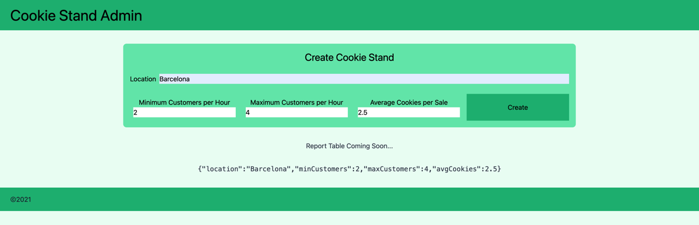
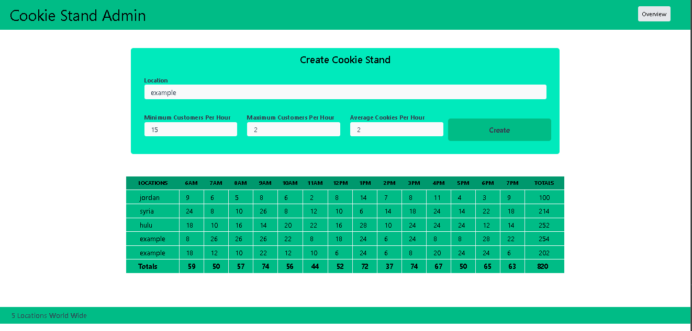

# Cookie Stand Admin

> Lab 37 :

- Run `npm run dev`
- Go to this URl `http://localhost:3000`

> Screen Shoot

> Lab 38 :
>
> version 2
>

> Lab 39 :
>
> version 3 Result
>
> use `username:admin, password:admin`
>
> loging

> pending data

> after fetchingdata

